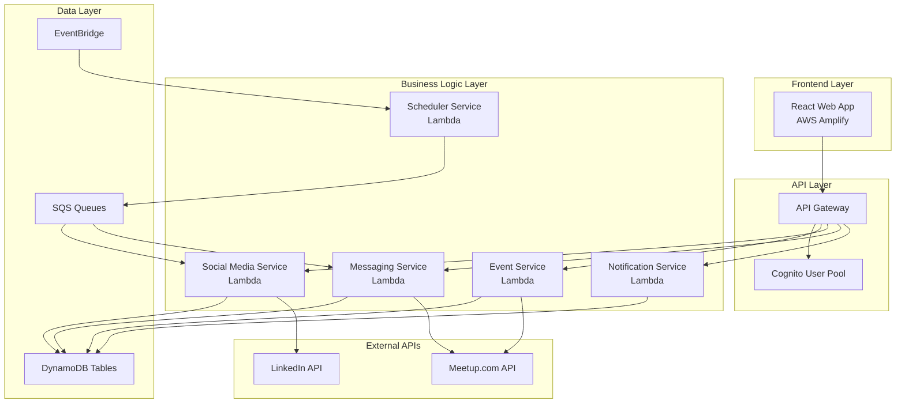

# Design Document

## Overview

LogiMeet is a serverless web application built on AWS that provides automated event management for meetup organizers. The system integrates with Meetup.com and LinkedIn APIs to create events, schedule social media posts, send automated messages, and provide comprehensive notifications. The architecture follows serverless principles using AWS SAM for infrastructure as code, with a React-based frontend hosted on AWS Amplify.

## Architecture

### High-Level Architecture

The system follows a serverless microservices architecture with clear separation of concerns:



### Deployment Architecture

All components are deployed via a single SAM template that provisions:
- Lambda functions for business logic
- API Gateway for REST endpoints
- Cognito for authentication
- DynamoDB for data persistence
- EventBridge for scheduling
- SQS for message queuing
- Amplify for frontend hosting

## Components and Interfaces

### Frontend Components

**Authentication Component**
- Handles Cognito authentication flow
- Manages social login with Google
- Maintains user session state

**Event Management Component**
- Event creation and editing forms
- Integration status display
- Event scheduling interface

**Social Media Component**
- Post scheduling configuration
- Template management
- Post status monitoring

**Messaging Component**
- Message template editor
- Recipient targeting options
- Message history and status

**Notification Component**
- Notification preferences
- Activity feed
- Alert management

### Backend Services

**Event Service**
- Creates draft events directly on Meetup.com in unpublished state when manual confirmation is enabled
- Creates published events directly on Meetup.com when manual confirmation is disabled
- Manages event lifecycle including draft, pending confirmation, and published states
- Publishes draft events on Meetup.com and creates LinkedIn events upon confirmation
- Handles event modifications and cancellations on external platforms
- Stores event metadata and external references
- Synchronizes with external platforms to import existing events including drafts
- Manages draft approval workflows for events and associated content

**Synchronization Service**
- Polls Meetup.com API for new and updated events
- Imports existing events from connected Meetup.com groups
- Detects external changes and updates local event data
- Resolves synchronization conflicts with external platform priority
- Manages periodic sync schedules and error handling

**Social Media Service**
- Schedules and publishes LinkedIn posts
- Manages post templates and content
- Tracks post performance and status
- Handles post failures and retries
- Supports draft mode with pending confirmation status

**Messaging Service**
- Sends targeted messages via Meetup.com API
- Differentiates between attendees and non-RSVP'd members
- Manages message templates and personalization
- Tracks message delivery status
- Supports draft mode with pending confirmation status

**Notification Service**
- Sends notifications via email and in-app
- Manages notification preferences
- Handles error notifications and alerts
- Provides activity summaries
- Notifies about synchronization conflicts and draft approvals

**Scheduler Service**
- Manages time-based triggers via EventBridge
- Processes scheduled social media posts
- Handles messaging schedules
- Manages reminder notifications
- Coordinates synchronization cycles

### API Interfaces

**REST API Endpoints**
```
POST /events - Create new event
GET /events - List user events
PUT /events/{id} - Update event
DELETE /events/{id} - Cancel event
POST /events/{id}/confirm - Confirm draft event for publishing
POST /events/sync - Trigger manual synchronization

POST /social/schedule - Schedule social media posts
GET /social/posts - List scheduled posts
DELETE /social/posts/{id} - Cancel scheduled post

POST /messages/schedule - Schedule messages
GET /messages - List message history
PUT /messages/templates - Update message templates

GET /notifications - Get user notifications
PUT /notifications/preferences - Update notification settings

GET /sync/status - Get synchronization status
POST /sync/resolve-conflict - Resolve synchronization conflict
```

## Data Models

### User Profile
```typescript
interface UserProfile {
  userId: string;
  email: string;
  name: string;
  meetupCredentials: EncryptedCredentials;
  linkedinCredentials: EncryptedCredentials;
  notificationPreferences: NotificationSettings;
  manualConfirmationEnabled: boolean;
  lastSyncTime: Date;
  createdAt: Date;
  updatedAt: Date;
}
```

### Event
```typescript
interface Event {
  eventId: string;
  userId: string;
  title: string;
  description: string;
  dateTime: Date;
  location: string;
  meetupEventId?: string; // Always present for events created via platform
  meetupEventStatus: 'draft' | 'published' | 'cancelled'; // Status on Meetup.com
  linkedinEventId?: string;
  linkedinEventStatus?: 'draft' | 'published' | 'cancelled'; // Status on LinkedIn
  platformStatus: 'pending_confirmation' | 'confirmed' | 'cancelled'; // Platform workflow status
  source: 'platform' | 'meetup_import' | 'linkedin_import';
  requiresConfirmation: boolean;
  publishToMeetup: boolean;
  publishToLinkedIn: boolean;
  socialPostsScheduled: boolean;
  messagesScheduled: boolean;
  lastSyncTime: Date;
  externallyModified: boolean;
  createdAt: Date;
  updatedAt: Date;
}
```

### Scheduled Post
```typescript
interface ScheduledPost {
  postId: string;
  eventId: string;
  userId: string;
  platform: 'linkedin';
  content: string;
  scheduledTime: Date;
  status: 'pending' | 'pending_confirmation' | 'published' | 'failed' | 'cancelled';
  externalPostId?: string;
  errorMessage?: string;
  requiresConfirmation: boolean;
  createdAt: Date;
}
```

### Message
```typescript
interface Message {
  messageId: string;
  eventId: string;
  userId: string;
  recipientType: 'attendees' | 'non_rsvp_members';
  content: string;
  scheduledTime: Date;
  status: 'pending' | 'pending_confirmation' | 'sent' | 'failed' | 'cancelled';
  recipientCount: number;
  sentCount: number;
  errorMessage?: string;
  requiresConfirmation: boolean;
  createdAt: Date;
}
```

### Synchronization Record
```typescript
interface SyncRecord {
  syncId: string;
  userId: string;
  platform: 'meetup' | 'linkedin';
  lastSyncTime: Date;
  status: 'success' | 'failed' | 'in_progress';
  eventsImported: number;
  eventsUpdated: number;
  conflictsDetected: number;
  errorMessage?: string;
  createdAt: Date;
}
```

### Sync Conflict
```typescript
interface SyncConflict {
  conflictId: string;
  eventId: string;
  userId: string;
  platform: 'meetup' | 'linkedin';
  conflictType: 'title_mismatch' | 'date_mismatch' | 'description_mismatch' | 'status_mismatch';
  localValue: string;
  externalValue: string;
  status: 'pending' | 'resolved_local' | 'resolved_external';
  createdAt: Date;
  resolvedAt?: Date;
}
```

### Notification
```typescript
interface Notification {
  notificationId: string;
  userId: string;
  type: 'success' | 'error' | 'warning' | 'info';
  title: string;
  message: string;
  relatedEntityId?: string;
  relatedEntityType?: string;
  read: boolean;
  createdAt: Date;
}
```
## Correctness Properties

*A property is a characteristic or behavior that should hold true across all valid executions of a system-essentially, a formal statement about what the system should do. Properties serve as the bridge between human-readable specifications and machine-verifiable correctness guarantees.*

After analyzing the acceptance criteria, I've identified several redundancies that can be consolidated:

**Property Reflection:**
- Properties 2.2 and 3.4 (success confirmation for Meetup and LinkedIn) can be combined into a single event creation success property
- Properties 2.3 and 3.3 (error handling for Meetup and LinkedIn) can be combined into a single event creation error handling property
- Properties 6.1, 6.2, and 6.3 (notification behaviors) can be consolidated into comprehensive notification properties

**Consolidated Properties:**

Property 1: Authentication flow completion
*For any* valid authentication token, the system should create or retrieve a user profile and grant platform access
**Validates: Requirements 1.2**

Property 2: Session expiration handling
*For any* expired session, the system should redirect to login page and preserve the intended destination
**Validates: Requirements 1.3**

Property 3: Session invalidation on logout
*For any* logout action, the system should invalidate the session and redirect to login page
**Validates: Requirements 1.4**

Property 4: Event creation success handling
*For any* successful event creation (Meetup.com or LinkedIn), the system should store the event reference and display confirmation
**Validates: Requirements 2.2, 3.4**

Property 5: Event creation error handling
*For any* failed event creation attempt, the system should display error messages, maintain input data, and continue with other tasks where applicable
**Validates: Requirements 2.3, 3.3**

Property 6: Event modification propagation
*For any* valid event modification, the system should update the corresponding external platform events and all related scheduled content
**Validates: Requirements 2.4, 4.5**

Property 7: Permission-based feature access
*For any* user with LinkedIn permissions, the system should enable LinkedIn event creation options, while users without permissions should not see these options
**Validates: Requirements 3.1**

Property 8: Social post scheduling consistency
*For any* event creation, the system should schedule exactly 5 LinkedIn posts at intervals of 1 month, 2 weeks, 1 week, 3 days, and day of event
**Validates: Requirements 4.1**

Property 9: Scheduled post execution
*For any* scheduled post with an arrived time, the system should publish the content to LinkedIn at the correct time
**Validates: Requirements 4.2**

Property 10: Event cancellation cleanup
*For any* event cancellation, the system should remove all remaining scheduled posts associated with that event
**Validates: Requirements 4.4**

Property 11: Message recipient targeting
*For any* messaging operation, the system should send different content to attendees versus non-RSVP'd group members, with each group receiving only appropriate messages
**Validates: Requirements 5.1, 5.2, 5.3**

Property 12: Message template application
*For any* template customization, the system should apply updated templates to all future messages
**Validates: Requirements 5.5**

Property 13: Error isolation in messaging
*For any* message failure, the system should log the error and continue processing remaining messages without interruption
**Validates: Requirements 5.4**

Property 14: Comprehensive notification delivery
*For any* automated action (success, failure, or requiring intervention), the system should send appropriate notifications with correct priority and actionable information
**Validates: Requirements 6.1, 6.2, 6.3**

Property 15: Notification preference enforcement
*For any* notification preference update, the system should respect the organizer's communication preferences for all subsequent notifications
**Validates: Requirements 6.4**

Property 16: Inactivity reminder system
*For any* organizer who becomes inactive, the system should send reminder notifications about upcoming events requiring attention
**Validates: Requirements 6.5**

Property 17: Event synchronization and import
*For any* connected Meetup.com account, the system should retrieve and import all existing events while preserving event details and maintaining external references
**Validates: Requirements 9.1, 9.2**

Property 18: External change detection
*For any* event modified externally on Meetup.com, the system should detect the changes during synchronization and update local event data accordingly
**Validates: Requirements 9.3, 9.4**

Property 19: Synchronization conflict resolution
*For any* synchronization conflict, the system should prioritize external platform data and notify the organizer of discrepancies
**Validates: Requirements 9.5**

Property 20: Draft event creation on Meetup.com
*For any* organizer with manual confirmation enabled, the system should create events as drafts directly on Meetup.com in unpublished state, allowing co-organizer collaboration
**Validates: Requirements 10.1, 10.2**

Property 21: Draft event confirmation workflow
*For any* draft event confirmation, the system should publish the existing draft event on Meetup.com, create LinkedIn events if selected, and activate all scheduled posts and messages
**Validates: Requirements 10.3**

Property 22: External draft publication detection
*For any* draft event published externally on Meetup.com by co-organizers, the system should detect the publication during synchronization and update the event status accordingly
**Validates: Requirements 10.4**

Property 23: Draft event rejection cleanup
*For any* rejected draft event, the system should cancel all associated scheduled posts and messages
**Validates: Requirements 10.5**

## Error Handling

### API Integration Errors
- **Meetup.com API failures**: Implement exponential backoff retry logic with circuit breaker pattern
- **LinkedIn API failures**: Handle rate limiting and permission errors gracefully
- **Authentication failures**: Provide clear error messages and re-authentication flows

### Data Consistency
- **Event synchronization**: Maintain consistency between local event data and external platform events
- **Scheduled task failures**: Implement dead letter queues for failed scheduled operations
- **Concurrent modifications**: Use optimistic locking to prevent data conflicts

### User Experience
- **Partial failures**: Allow operations to succeed partially (e.g., Meetup creation succeeds but LinkedIn fails)
- **Offline scenarios**: Cache critical data and sync when connectivity returns
- **Timeout handling**: Provide appropriate feedback for long-running operations

## Testing Strategy

### Dual Testing Approach

The system requires both unit testing and property-based testing to ensure comprehensive coverage:

**Unit Testing Requirements:**
- Unit tests verify specific examples, edge cases, and error conditions
- Focus on integration points between components
- Test specific scenarios like authentication flows, API error responses, and UI interactions
- Validate concrete examples of event creation, message sending, and notification delivery

**Property-Based Testing Requirements:**
- Use **fast-check** as the property-based testing library for JavaScript/TypeScript
- Configure each property-based test to run a minimum of 100 iterations
- Each property-based test must be tagged with a comment explicitly referencing the correctness property: `**Feature: logimeet, Property {number}: {property_text}**`
- Each correctness property must be implemented by a single property-based test
- Property tests verify universal properties that should hold across all inputs
- Generate smart test data that constrains to valid input spaces (valid event data, user credentials, etc.)

**Complementary Coverage:**
- Unit tests catch concrete bugs in specific scenarios
- Property tests verify general correctness across many input variations
- Together they provide comprehensive validation of system behavior

### Testing Framework Configuration
- **Jest** for unit testing framework
- **fast-check** for property-based testing
- **React Testing Library** for frontend component testing
- **AWS SDK mocks** for testing AWS service integrations
- **MSW (Mock Service Worker)** for API integration testing

### Test Data Generation
- Generate realistic event data with valid dates, locations, and descriptions
- Create varied user profiles with different permission combinations
- Generate edge cases for scheduling (timezone handling, past dates, etc.)
- Test with different message templates and recipient lists

### Integration Testing
- Test complete workflows from event creation to social media posting
- Validate end-to-end authentication and authorization flows
- Test scheduled task execution and error recovery
- Verify notification delivery across different channels

### Performance Testing
- Load testing for concurrent event creation
- Stress testing for scheduled post processing
- Memory usage validation for large recipient lists
- API rate limit handling verification